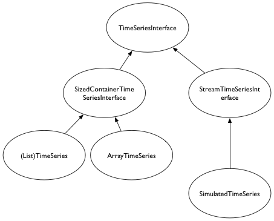

This will be graded along with the rest of your codebase at the course Milestone 1.

The idea of the final project part before Milestone 1 is to create an interface-implementation separation. Why?

- we have been mis-using `TimeSeries` with its list based implementation as a base class.
- we'd like to handle list based time series, numpy-array based time series, and even simulated and streaming time series through a common interface.

So let us get to it! Take a look at the inheritance diagram below.



## Part 1: Create a `TimeSeriesInterface` ABC

This should be a well documented **ABC** which defines a set of common methods that might be used both in sized-container based time series  as well as stream based and simulated time series (for e.g. the time series `range(1000)` or that represented by successive (to infinity) fibonaccis).

I'll let you decide what methods ought to go into this ABC and what dont, but can tell you that the constructor is not part of the interface, and that the way to think about this is: that for example, `__iter__` makes sense both for containers and iterables, but that `values` only makes sense for containers. Or in other words, iterators make sense here, but not containers.

So the way to think about it is: which methods you defined in the last installation of the project so far ought to be hoisted into the common interface?

## Part 2: Create a `SizedContainerTimeSeriesInterface` ABC

This is also an ABC, but its one that inherits from the `TimeSeriesInterface` ABC.

This ABC now adds in the methods you left out in the `TimeSeriesInterface` which pertain to its "containerness": the notions of indexing, length, and returning arrays in addition to iterators


## Part 3: Reparent your existing classes

So now the existing `TimeSeries` and `ArrayTimeSeries` must be reparented. Note that some methods in `ArrayTimeSeries` might have been inherited from `Timeseries`. Some of this code may have to be defined in one of the above ABC's (its perfectly fine for ABCs to not have all methods `@abstractmethod`ed)

Make sure that all tests you had working earlier still work. These tests will ensure that this refactoring effort on your part does not break anything.

Note that you'll have different constructors here: thats ok. The constructors are not (yet) part of any common interface.

## Part 4: Define a `StreamTimeSeriesInterface` and a `SimulatedTimeSeries` class that inherits from it.

Ok, so now its time to handle those time-series which dont have an underlying array (or more generally, storage). At least two types of time series fall into this category:

1. those that have a generating process behind them: these are infinite and inherently lazy. You dont compute more of them until you need that part.
2. time series that come in from a continuous stream: for example a time series coming in from a web-server log or a set of events on some Internet-of-things device in your infrastructure. (eventually you might save these in a database but you want to operate on these first)

To handle these cases, we'll add a single additional abstract (generator) method to the `StreamTimeSeriesInterface`:

```python
    def produce(self, chunk=1):
        pass
```

which produces a chunk sized bunch of new elements into the timeseries whenever it is called (document it).

Now create a `SimulatedTimeSeries` class which has a constructor that takes a generator as an argument, starts it, and perhaps primes it. (or uses a boolean to keep track of the priming)

An example of such a generator would be `make_data` from hw6.

The subtlety here is that the `produce` method can handle data in chunks, so to implement this class properly, the instance variable used by the constructor that saves the called generator function can be used inside `produce` to advance by `chunk` `next`s.

Indeed you could use `make_data` to test your code.

## EXTRA CREDIT Part 5: Mean and Standard Deviation

Add `mean` and `std` method interfaces at the appropriate places in the hierarchy. These methods should return floating point numbers. (an optional `chunk` argument is needed in some cases) Also add an `online_mean` and `online_std` for `StreamTimeSeriesInterface` time-series, which themselves return the appropriate time-series. These "online" methods should return new `SimulatedTimeSeries` of the appropriate type, and when `produce` is called on them, should produce `chunk` means and standard deviations, starting from the current state of the time series. (notice that this will be the meaning of `mean` and `std` with non default `chunk` as well: ie, the last `chunk` observations' statistic )

Put this code into your project repo.
